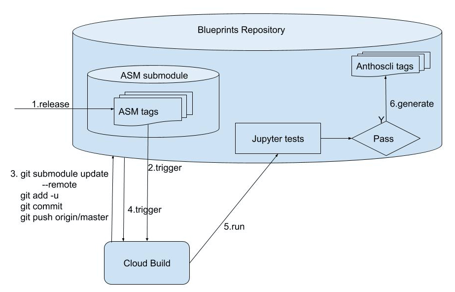

# Blueprints

This repository sets up a central qualification framework for blueprint releases
(e.g. Anthos Service Mesh) to guarantee they work for a particular version of Anthos CLI.
It provides a continuous integration pipeline to monitor new blueprint release tags,
trigger integration tests for validation, and eventually tag the release candidate
for all blueprints.

## Validation Workflow

Each individual blueprint will be a submodule of this repository, such as ASM, CI/CD, multi-tenancy, and etc.

The workflow depends on [Cloud Build](https://cloud.google.com/cloud-build/docs) setup on both the blueprint repo and this main repo.

The diagram shows the workflow: 

1. A blueprint release is published
2. The release tag triggers a cloud build
3. The cloud build task updates the submodule and pushes up the changes to this repo
4. The changes in this repo triggers another cloud build
5. The cloud build runs the end-to-end tests using Jupyter-based framework
6. An anthoscli tag is generated if the tests pass


## How to add new Blueprints

The blueprint owners need to setup a cloud build similar as [this](https://github.com/nan-yu/anthos-service-mesh-packages/blob/standard-release-process/cloudbuild.yaml).

Then the owners can create a pull request to add the blueprint repo as a submodule:
```bash
git submodule add YOUR_BLUEPRINT_REPO_URL
```

## Validation Monitoring

The cloud build history for validation is listed under the `anthos-blueprints-validation project.

The release candidates for anthoscli verified blueprints are listed [here](https://github.com/GoogleCloudPlatform/blueprints/releases)


## Contributing

Go to the [contributing.md](docs/contributing.md) documentation

### Code of conduct

Participation in the Google Open Source community is governed by the [Code of Conduct](docs/code-of-conduct.md).
