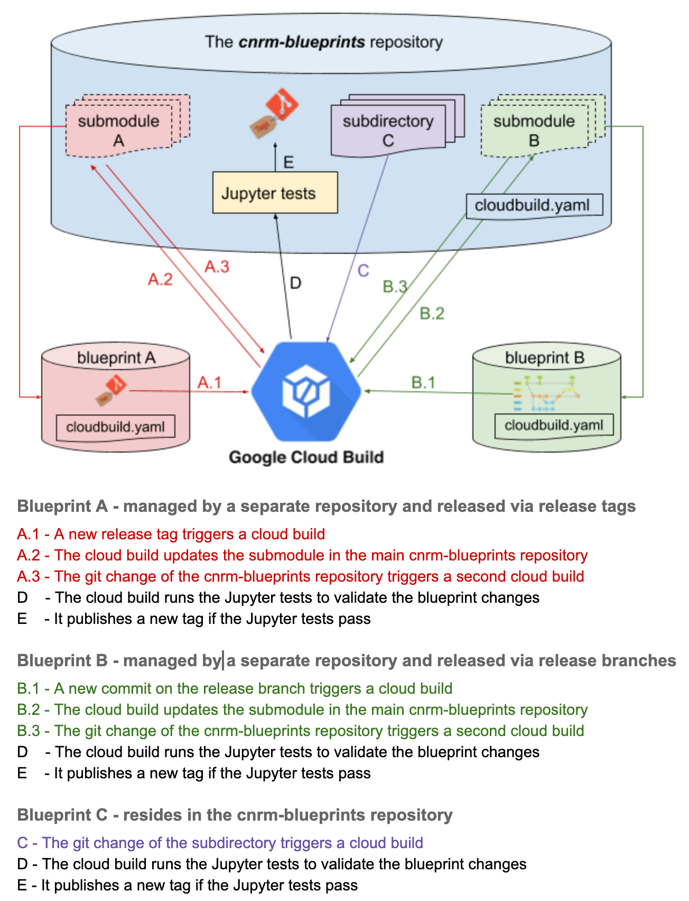

# ASM Blueprints

## NOTE: This repository was developed for use with `anthoscli` and is no longer maintained.
## For other blueprints, check the [blueprints repository](https://github.com/GoogleCloudPlatform/blueprints).

This repository sets up a central qualification framework for blueprint releases
(e.g. Anthos Service Mesh) to guarantee they work for a particular version of Anthos CLI.
It provides a continuous integration pipeline to monitor new blueprint releases,
trigger integration tests for validation, and eventually tag the release candidate
for all blueprints.

The framework supports blueprints as submodules, as well as subdirectories in the central repository.

## Validation Workflow

The workflow leverages the [Jupyter-based](https://jupyter.org/) test approach and
run it on [Google Cloud Build](https://cloud.google.com/cloud-build/docs).



The diagram shows the workflow and covers the following scenarios:
1. A blueprint is managed by a separate repository and is released via release tags
2. A blueprint is managed by a separate repository and is released via release branches
3. A blueprint resides in the same repository

For the first two cases, the blueprints will be linked as submodules of the main repository.
A cloud build configuration file will be set up in each blueprint repository.
Whenever a new release is published, the cloud build will update the submodule in the main repository.
Then a second cloud build will be kicked off to run the validation tests.
A new release tag of the main repository will be published if all tests look good.

The blueprints, the Anthos CLI versions and the format of the new release tag are defined in the [anthoscli-release-candidates.json](anthoscli-release-candidates.json) file.

## How to add new Blueprints

### 1. Blueprints managed by separate repositories

The blueprint owners need to setup CloudBuild configuration
- Copy the template: [blueprint-cloudbuild.yaml](test/templates/blueprint-cloudbuild.yaml) to the root directory of the blueprint repository, rename it to cloudbuild.yaml
- Update `_CNRM_BLUEPRINTS_SUBMODULE_PATH` with the correct SUBMODULE_PATH in the [cloudbuild.yaml]((test/templates/blueprint-cloudbuild.yaml#L86)) file
- Copy [id_rsa.enc](test/ssh/id_rsa.enc) to the root directory of the blueprint repository
- Copy [know_hosts](test/ssh/known_hosts) to the root directory of the blueprint repository
- Push the changes to the blueprint repository: `git add -u && git commit -m "Setup CloudBuild configuration for the qualification framework" && git push origin <BRANCH>`
- Connect CloudBuild to the blueprint repository [link](https://pantheon.corp.google.com/cloud-build/triggers/connect?project=anthos-blueprints-validation&organizationId=433637338589)
- Create a trigger [link](https://pantheon.corp.google.com/cloud-build/triggers/add?project=anthos-blueprints-validation&organizationId=433637338589)
  - `Name`: the name of the trigger, e.g. `ASM-release-trigger`
  - `Description`: the description of the trigger, e.g. `The CloudBuild release trigger for ASM package`
  - `Event`: it depends on the release strategy.
    - If the blueprint publishes releases via tags, set `Event` to `Push new tag` and in the `Source` section, use a regular expression to match to the release tag format, e.g. `^v\d+.\d+.\d+$`.
    - If the blueprint publishes releases via release branches, set `Event` to `Push to a branch` and in the `Source` section, use a regular expression to match to the branch, e.g. `^release-\d+.\d+-asm$`
  - `Source`: select the corresponding `Repository`
  - `Build Configuration File Type`: set to `Cloud Build configuration file (yaml or json)` and verify the `Cloud Build configuration file location`
  - Click the `CREATE` button to create the trigger
  - **Note**: in the release branch case, please create a trigger per release branch. If you have N release branches, N CloudBuild triggers need to be created.

The blueprint owners need to create a pull request to add the blueprint repository as a submodule
- Clone the cnrm-blueprints repo: `git clone git@github.com:GoogleCloudPlatform/cnrm-blueprints.git --recursive`
- Add the current blueprint as a submodule: it depends on the release strategy. If it uses release branches, a submodule needs to be added per release branch.
  - release tags: `git submodule add --name <NAME> <BLUEPRINT_REPO_URL> <SUBMODULE_PATH>`. e.g. `git submodule add --name asm git@github.com:GoogleCloudPlatform/anthos-service-mesh-packages.git asm`
  - release branches: `git submodule add -b <BRANCH> --name <NAME> <BLUEPRINT_REPO_URL> <SUBMODULE_PATH>`. e.g.
    ```
    git submodule add -b release-1.4-asm --name asm-1.4 git@github.com:GoogleCloudPlatform/anthos-service-mesh-packages.git asm-1.4
    git submodule add -b release-1.5-asm --name asm-1.5 git@github.com:GoogleCloudPlatform/anthos-service-mesh-packages.git asm-1.5
    git submodule add -b release-1.6-asm --name asm-1.6 git@github.com:GoogleCloudPlatform/anthos-service-mesh-packages.git asm-1.6
    ```
- Add the SUBMODULE_PATH to the `blueprints` list in [anthoscli-release-candidates.json](anthoscli-release-candidates.json) to include the new blueprint
- Create a commit: `git add -u && git commit -m "Add XXX blueprint as a submodule"`
- Push up the commit to a fork or a separate branch: e.g. `git checkout -b submodule && git push origin submodule`
- Create a Pull Request


### 2. Blueprints reside in the same repository

- Add the blueprint packages to a separate subdirectory
- Add the subdirectory name to the `blueprints` list in [anthoscli-release-candidates.json](anthoscli-release-candidates.json) to include the new blueprint
- Create a commit: `git add -u && git commit -m "Add XXX blueprint as a subdirectory"`
- Push up the commit to a fork or a separate branch: e.g. `git checkout -b subdirectory && git push origin subdirectory`
- Create a Pull Request

## Validation Monitoring

The cloud build history for validation is listed under the `anthos-blueprints-validation` project: [link](https://pantheon.corp.google.com/cloud-build/builds?organizationId=433637338589&project=anthos-blueprints-validation).

The release candidates for Anthos CLI verified blueprints are listed [here](https://github.com/GoogleCloudPlatform/blueprints/releases)


## Contributing

Go to the [contributing.md](docs/contributing.md) documentation

### Code of conduct

Participation in the Google Open Source community is governed by the [Code of Conduct](docs/code-of-conduct.md).
